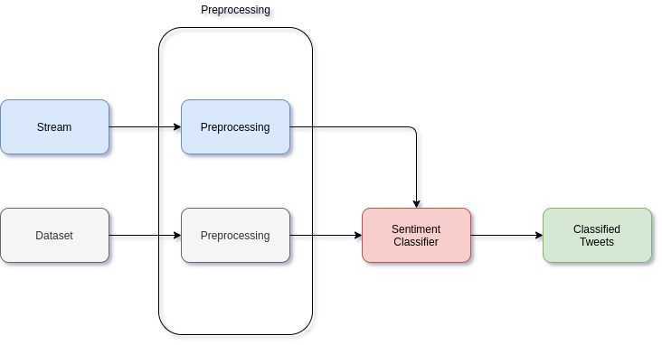

# Assignment №2. Introduction to Big Data. Stream Processing with Spark

**DS-02 Team Members and Roles:**

* **Artem Bakhanov**

Team management, stream reading, model creation and tuning (linear SVC), code refactoring

* **Dmitry Podpryatov**

Model creation (random forest) and tuning (all but SVC), data preprocessingб report

* **Kamil Kamaliev**

Model creation (logistic regression), stream, data preprocessing and merging datasets, report

* **Marina Nikolaeva**

Model evaluation (scripts and labeling), support internationality of the team, report

## The Problem

**What:**
Given a stream of tweets, analyze their sentiment using Apache Spark. The task is to build a model that will predict
whether a given tweet possesses a positive or negative emotions.

**Why:** First of all, to practice our Spark skills. Second of all, this can be useful for companies because they can
get customers' opinion about their products &mdash; and thus fix what's bad or understand what people like. 

## The Solution

We divided the work into stages and created a pipeline that can be summarized as follows:



**1. Selecting data**
 
We selected datasets from assignment description that we thought would suit us the most, and merged
them together.
Check out [references](#references) for the sources that we selected. Basically, we were looking for a pair
(sentiment, sentence / paragraph / text) for our classification models.

You can find `.ipynb` notebook where the datasets were merged together in the `merging datasets` folder.
The result of the merge is situated in the `data` folder. The data was split on the train and test at this point,
so we will not have to do it at the preprocessing stage.

**2. Preprocessing**

Before feeding the data to the classification models, we need to preprocess it. Since both our data and tweets from the
stream have similar format, the preprocessing module will be the same for the dataset and for the stream.

The preprocessing consists of several part:

    1. Get rid of unimportant information such as tags (@elonmusk, #twitter), hyperlinks (https://google.com), 
    html tags (<br /><br />), and repeated symbols (amaaaazing).
    
    2. Tokenization - split text into words (lowercasing is done in this step as well)
    
    3. Remove "stopwords" - words that do not influence the sentiment of the text (they, to, be, because, that, etc.)

    4. Transform words to vector model so that it can be fed into the classification model (Word2Vec)

`Stopwords` were taken from the default set of `org.apache.spark.ml.feature.StopWordsRemover`. We decided to keep words `against`, `no`, `not` as they may help to identify such negative tweets as `not cool!`.

As it was mentioned before, we have already split the data into train and test samples, so we do not have to do it here.


Training dataset is preprocessed by calling `prep_train(df_train)` and testing dataset is preprocessed by calling `prep_test(df_test)`. Steps are almost the same except the ones related to `word2vec`.

`Word2Vec` is trained on our training dataset when preprocessing it. After that, `word2vec` is saved to hdfs. When preprocessing test and stream datasets we just load the trained `word2vec` and use it. Also, we wanted to try preptrained `word2vec` but each time ran out of memory. Thus, we gave up that idea.

```
IMPORTANT

Do not delete folders/files
- word2VecModel
- test_data.csv
- train_data.csv
```

The preprocessing code is situated at the `src/main/scala` folder within `Preprocessing.scala` and `TrainWord2Vec.scala`.

**3. Classification**

After the data is preprocessed, it is fed into the classification models. Among all classification models we have chosen
[Logistic Regression](https://en.wikipedia.org/wiki/Logistic_regression#:~:text=Logistic%20regression%20is%20a%20statistical,a%20form%20of%20binary%20regression),
[Ranodm Forest](https://en.wikipedia.org/wiki/Random_forest), and [Support Vector Clustering (SVC)](https://en.wikipedia.org/wiki/Support_vector_machine).
We also tried to implement [Naive Bayes](https://en.wikipedia.org/wiki/Naive_Bayes_classifier) classifier, however it accepted only vectors with nonnegative values, so we got to
apply scaling which would mess up the `Word2Vec`, so we rejected this idea.

`ml` and `mllib` packages contain all listed classifiers. We will tune the models and compare their performance on the data.
Hyperparameters were tuned with cross validation and grid search for each classifier. Below are the grids and the best
parameters for each model. For detailed description of the hyperparameters check out links in the [references](#references) at the end.

**Logistic Regression**

| Parameter | Grid | Best Value |
| :--- | :---: | :---: |
| `elasticNetParam` | 0, 0.5, 0.8, 1 | 0.5 |
| `fitIntercept` | true, false | true |
| `maxIter` | 1000 | 1000 |
| `regParam` | 0, 0.1, 0.2 | 0.1 |
| `threshold` | 0.5 | 0.5 |

**Random Forest**

| Parameter | Grid | Best Value |
| :--- | :---: | :---: |
| `impurity` | entropy, gini | gini |
| `maxDepth` | 3, 5, 7 | 7 |
| `numTrees` | 20, 40 | 40 |

**SVC**

| Parameter | Grid | Best Value |
| :--- | :---: | :---: |
| `aggregationDepth` | 2, 3 | 2 |
| `maxIter` | 100, 150 | 150 |
| `threshold` | 0.4, 0.5, 0.6 | 0.6 |
| `regParam` | 0, 0.1, 0.2 | 0 |

We can assess the quality of our models using [F1 Score](https://en.wikipedia.org/wiki/F1_score) on our testing dataset. Below is the table with
models' F1 Score:

| Classifier | F1 Score |
| :--- | :---: |
| Logistic Regression | 0.721 |
| Random Forest | 0.718 |
| SVC | 0.586 |


After training and testing on corresponding dataset, models are saved to hdfs, so they can be loaded and used while proccessing stream.

The code for classifiers is situated in the `Classifiers.scala` (cross validation and grid search) and in the
`TrainClassifier.scala` the best parameters have been set explicitly to save time.

```
IMPORTANT

Do not delete folders/files
- logRegModel
- randomForestModel
- svcModel
```


**4. Processing the Stream**

`Stream Address: 10.90.138.32:8989`

Performed steps:
1. Load trained models from hdfs.
2. Take the tweet(s) from stream
3. Put them into new empty dataframe called stream.
4. Preprocess it by calling prep_test(stream) function that was mentioned in section 2. Preprocessing
5. For each model, send the preprocced data and acquire predictions.
6. Add column with current timestamp and save to csv.

For each model, results are stored in `stream/modelname/part-r-...`

For example, the output of logistic regression model is stored in `stream/logRegModel/part-r-...`

Outputs are in the form of:
```
timestamp, twit, model prediction
```

Example of the output:
```
2020-10-08T09:59:04.199+03:00,@brendonuriesays helloooo brendon(: reply please,1.0
```

Results may be stored in several files. To make our lives a bit easier, at the end, we unite all the outputs to a single file for each model in `stream_final` folder.

For example, for random forest model, the final file is as follows `stream_final/randomForestModel/part-r-00000...`

And its content is:
```
2020-10-08T04:48:01.310+03:00,@breedimetria mannnn hell yea dat nigga be parkin lot pumpin.....I made a mistake &amp;saw a parkin lot scene in his phone one day! Kilt me,0.0
2020-10-08T00:33:01.783+03:00,@DavidRozansky We had a VERY active BBS community here $ yrs. 100s of 'em. Even 1st national relay FIDO-Nets.  AOL killed BBSing.    LOSS!,0.0
2020-10-08T02:06:01.352+03:00,@Davinche I know  Them times there having a phone that could save more than 10 messages was big so how was I 2 know it wud evolve so quick,0.0
2020-10-08T04:46:00.968+03:00,@breedimetria @blackaricanma alright ladies! I'll be back to chat l8r. Bout to take care of Lil A bcuz he doesnt feel well  ttyl twitches!,0.0
2020-10-08T07:20:01.351+03:00,@dawllyllama Sorry for the trauma - to u AND ur car  maybe coyote thought he was a super genius. But duh roadrunner always has last laugh.,0.0
2020-10-08T04:29:01.256+03:00,@breckpetekaren Not a big winter fan. the reason im still here- love the heat (&amp; job)but missing my nephews grow up  Im torn and stuck,1.0
2020-10-08T10:20:04.114+03:00,@BrennanAnnie - did a nice long stretch post easy spin and knee feeling good  only bummer is missing Britney tonight due to LDN transport!,1.0
...
```


## What can be Improved
1. Applying pretrained word2vec model. Our model is trained on a very small text corpus and can be biased since only twitter and reviews datasets were used.
2. Improving accuracy of the classifier by using advanced deep learning models (e.g. LSTM).
3. Better visualisation for the stream, for example create a web dashboard where all new tweets will appear and some aggregated statestics will be shown.
4. Apply stemming or lemmatization in preprocessing step. 
5. Better structure of the code.

TODO
## Testing and Comparing models on Stream
`stream_final/logRegModel`, `stream_final/randomForestModel`, `stream_final/svcModel` folders where downloaded to our local machines. 
After that, we put correct lables by our hands and calculated `precision`, `recall` and `f1 score` using the code in `test_scripts.`

TODO
## Conclusion  
TODO

## References

* [Assignment description](https://hackmd.io/@BigDataInnopolis/ryWL1HiKS#Writing-the-Report)

* Labeled datasets:
    * [Large Movie Review Dataset](http://ai.stanford.edu/~amaas/data/sentiment/) &mdash; binary classified sentiment
    dataset that contains a total of 50000 movie reviews;
    * [UCI Sentiment Labelled Senteces](https://archive.ics.uci.edu/ml/datasets/Sentiment+Labelled+Sentences) &mdash;
    binary classified reviews from [imbd.com](https://imbd.com), [amazon.com](https://amazon.com), and [yelp.com](https://yelp.com);
    * [Twitter Sentiment](https://www.kaggle.com/c/twitter-sentiment-analysis2/data) &mdash; sentimentally labeled twitter messages.

* [Reasons for twitter sentiment analysis](https://monkeylearn.com/blog/sentiment-analysis-of-twitter/#:~:text=Sentiment%20analysis%20is%20the%20automated,are%20talking%20about%20their%20brand.)

* Classifiers:
    * [Logistic Regression](https://en.wikipedia.org/wiki/Logistic_regression#:~:text=Logistic%20regression%20is%20a%20statistical,a%20form%20of%20binary%20regression)
    and [Parameters](https://spark.apache.org/docs/latest/api/scala/org/apache/spark/ml/classification/LogisticRegression.html)
    * [Ranodm Forest](https://en.wikipedia.org/wiki/Random_forest) and [Parameters](https://spark.apache.org/docs/latest/api/scala/org/apache/spark/ml/classification/RandomForestClassifier.html)
    * [Support Vector Clustering (SVC)](https://en.wikipedia.org/wiki/Support_vector_machine) and [Parameters](https://spark.apache.org/docs/latest/api/scala/org/apache/spark/ml/classification/LinearSVC.html)
    
* Classification Metrics:

    * [Precision and Recall](https://en.wikipedia.org/wiki/Precision_and_recall)
    * [F1 Score](https://en.wikipedia.org/wiki/F1_score)
